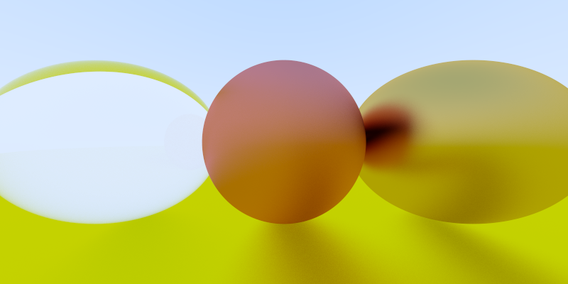

# vRayTracer

Simple raytracer in [vlang](https://vlang.io), learning the language as I go along so plenty of poor design choices, some for educational purposes. Based on [Ray Tracing in One Weekend](https://github.com/RayTracing/raytracinginoneweekend).

See f64 branch for more precise but slower implementation using 64 bit floats instead of 32bit.

### Current output

Output is ppm but this is converted with imagemagick `convert output.ppm output.png`

### Building & Running

Compile with `v -o bin/raytrace -prod raytrace.v`
Run with `./raytrace > output.ppm`

### Todo

* Code is a complete and utter mess.
  - Move Ray into module
  - Ray tracer module
* Take scene input from file
* Camera pos/fov
* Focal distance

#### Waiting on vlang for 
* Use Interfaces once working
* Use None instead of error once working
~~* Ensure overloading is used everywhere once working //TODO~~

### Complete

* PPM output
* Fuzz
* Albedo
* Reflection
* Scattering
* Lambertian material
* Metal material
* Dialectric material
* Command line arguments to image size (thanks [spytheman](https://github.com/spytheman).)
